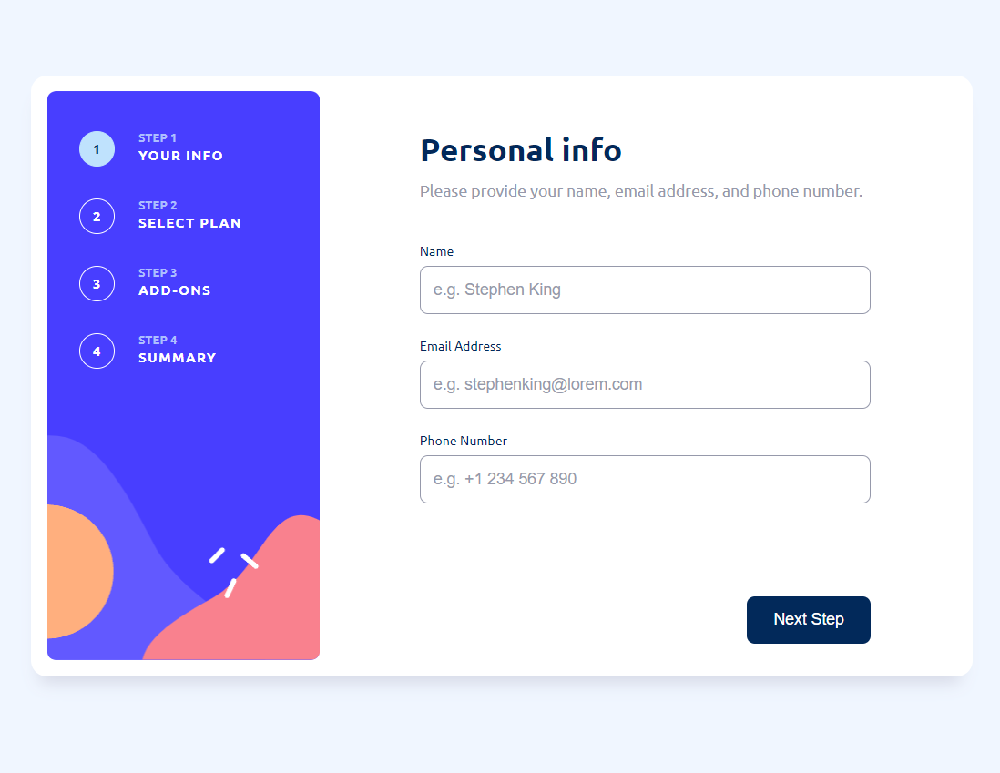
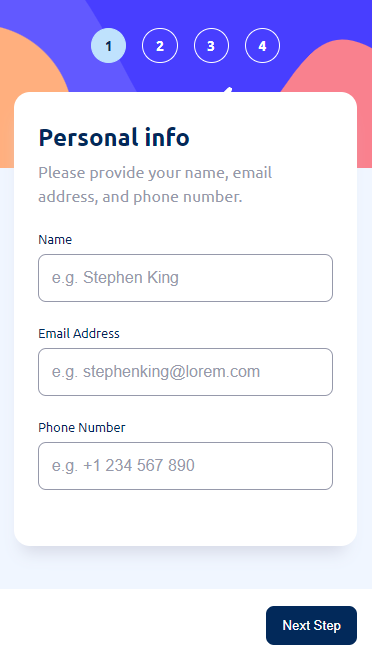
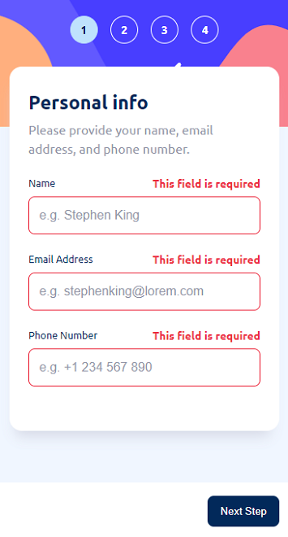
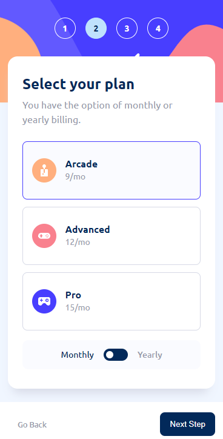
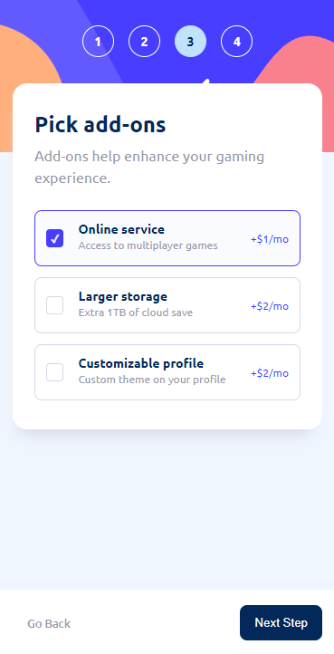
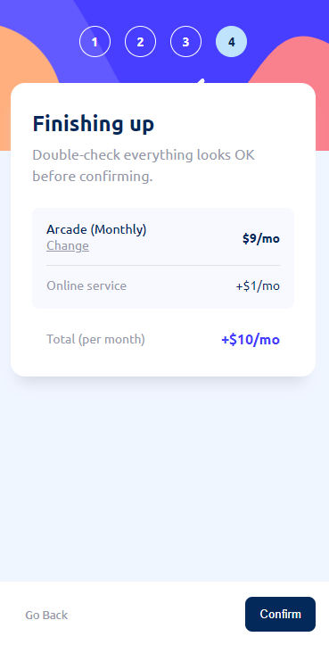
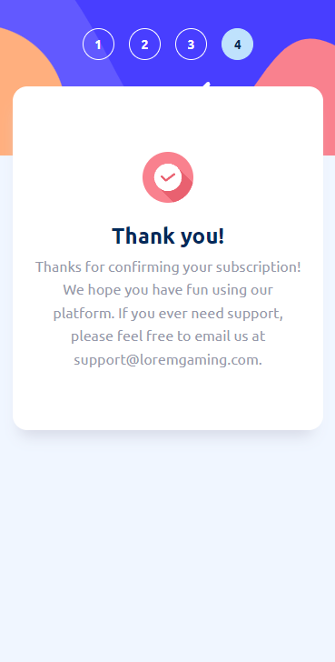
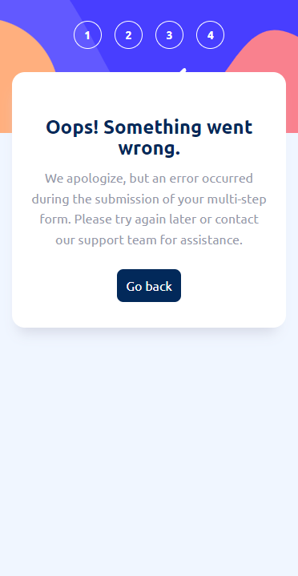
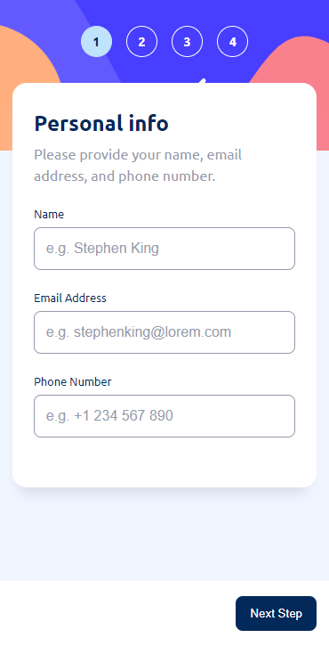

<h1 align="center">Multi-step Form</h1>

<div align="center">
  <h3>
    <a href="https://multi-step-form-maciejnarejko.vercel.app">
      Live
    </a>
    | 
    <a href="https://www.frontendmentor.io/solutions/multistep-form-react-typescript-scs-YJWepk0qP-">
      Solution
    </a>
    | 
    <a href="https://www.frontendmentor.io/challenges/multistep-form-YVAnSdqQBJ">
      Challenge
    </a>
  </h3>
</div>

## About the Project

The challenge is to build a multi-step form and make it look and function as closely as possible to the design. You are free to use any tools you prefer to accomplish this task.

Project assumptions:

- The app include a multi-step form that allows users to progress through a sequence of steps,
- Users should have the ability to go back to a previous step to update their selections,
- The interface should have a responsive layout that adapts to the user's device screen size,
- Check for the user's initial theme preference in local storage,
- Users should receive form validation messages;

This is a solution to the [Multi-step form on Frontend Mentor](https://www.frontendmentor.io/challenges/multistep-form-YVAnSdqQBJ).

## Screenshots

</img>

<details>
  <summary>more screenshots</summary>
</img>
</img>
</img>
</img>
</img>
</img>
</img>
</img>
</details>

## Folders

```
src/
├──assets/
|  └── images/
|      └── ...
├── components
│   └── StepNavigator/
│       ├── StepNavigator.tsx
│       └── StepNavigator.scss
├── context/
|   └── FormContext.tsx
├── pages/
│   ├── FormInfo/
│   │   ├── FormInfo.tsx
│   │   └── FormInfo.scss
│   │── FormPlan/
│   │   ├── FormPlan.tsx
│   │   └── FormPlan.scss
|   └── ...
├── style/
|   ├── _variables.scss
|   └── global.scss
├── __tests__/
|    ├── FormInfo.test.tsx
|    ├── FormPlan.test.tsx
|    └── ...
├──types/
|  └── svg.d.tsx
├── App.tsx
├── index.tsx
└── reportWebVitals.tsx
```

## Built with

- React 18.2.12
- React Router 6.11.2
- React Testing Library 14.0
- TypeScript 5.1.3
- Semantic HTML5 markup
- SCSS
- Mobile-first workflow

## Local Setup

1. Download or clone the repository.
2. Navigate to the project directory in your terminal.
3. Run `npm install` to install all dependencies.
4. Run `npm start` to start the development server.
5. Open a browser and navigate to `http://localhost:3000` to view the app.

## Running Tests

To run the tests, you can use the command `npm test`. This will start the test runner and run all tests in the project. You can also use the command `npm test [path-to-test-file]` to run a specific test file.

## Author

- Frontend Mentor - <a href="https://www.frontendmentor.io/profile/MaciejNarejko">@MaciejNarejko</a>

## Acknowledgments

Thanks to the FrontendMentor.io community for a code review.
Together we create better code.
